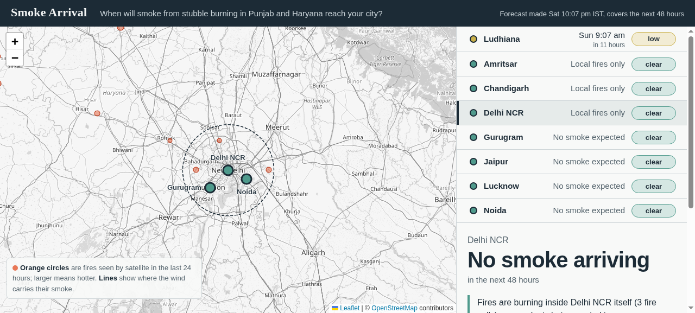

# Smoke Arrival

Forecasts **when** crop-residue burning smoke reaches a city, as a time rather
than a colour on a map.


**Live:** https://vslqqybf76ffiznakyjwbdj5qi0adzkw.lambda-url.ap-south-1.on.aws/



Built for Environmental Hacks (WeMakeDevs × AWS, 8-11 October 2026), Track: Air.
Team of three.

## The problem

Every October, farmers in Punjab and Haryana burn paddy residue. Delhi sits
250-400 km downwind and breathes it. Existing tools report air quality
**after** the smoke has arrived. They measure, they do not forecast. Nobody
can tell a school or someone with asthma: "smoke reaches you at 7pm tomorrow,
for a four-hour window."

## What it does

- **Arrival times, not colours.** Each city gets a clock time for first smoke,
  and hours from now.
- **The path on the map.** Every contributing fire cell is drawn with the route
  the wind carries its smoke.
- **A relative 0-100 smoke-load index** per city, so two cities on the same day
  can be compared.
- **The fires themselves**, sized by intensity, so cause and effect sit on one
  screen.
- **A hindcast.** The same pipeline replays a past date, for the days when the
  burning was bad.

## How it works

1. Four FIRMS sensors are downloaded, merged, de-duplicated, and snapped to
   0.25° cells. Each cell becomes one source, carrying the summed fire
   radiative power of every detection inside it.
2. Hourly wind on a 5×6 grid is fetched and converted to u/v components.
   Direction is where the wind blows *from*, so the sign flips.
3. Every source is carried forward through the wind in 1-hour steps, up to
   48 hours. Smoke thins with distance as it travels.
4. **Arrival** is the first hour a particle enters a city's radius. The index
   weights each arrival by fire power and by how far it travelled.
5. One JSON document comes out of the API; the page renders it.

## Quickstart

```bash
uv venv --python 3.13 .venv
uv pip install --python .venv/bin/python -r requirements.txt

.venv/bin/uvicorn app.main:app --port 8000     # then open http://localhost:8000
.venv/bin/python -m pytest tests -q            # 18 tests, no network needed
```

The live pipeline needs no API keys. Only the hindcast needs a free
`FIRMS_MAP_KEY` in the environment.

## The hindcast

```bash
.venv/bin/python scripts/hindcast.py 2025-11-05
```

Today may be a quiet day. This replays a day when the burning was bad, which is
the event the tool exists for.

## API

| Endpoint | Returns |
| --- | --- |
| `GET /health` | liveness check |
| `GET /api/cities` | the eight cities, with coordinates and arrival radii |
| `GET /api/forecast` | the full document: fires, wind, cities, arrivals, paths |
| `GET /api/forecast/{city}` | one city's block |

Responses are cached for 15 minutes, and the service falls back to the last
good response rather than failing.

## Reading the output honestly

- The index is **relative, not a concentration**. It ranks cities and days
  against each other; it is not µg/m³, and the JSON says so in `model_note`.
- Wind is the 10 m forecast, not the wind at the height smoke travels.
- The source region **deliberately includes Pakistani Punjab**. Smoke does not
  stop at a border, and pretending it does would flatter the model.
- On a calm day the page says *clear* everywhere. That is the correct answer,
  not a bug.

## Who built what

| Person | Built | AI assistant |
| --- | --- | --- |
| **Sagar** (seat A) | FIRMS ingestion across four sensors, with de-duplication and confidence filtering. Live and archived wind. The Lambda bundle, the Function URL and the deploy. | Codex |
| **Areen** (seat B) | The transport model: grid clustering, advection, arrival detection, the 0-100 index. The 18 tests. The hindcast replay. Integration and this writeup. | Hermes |
| **Ayesha** (seat C) | The FastAPI service with a 15-minute cache and a last-good fallback. The map page, the city board and the 48-hour arrival ruler. | Claude |

Every member used an AI assistant, disclosed above as the event rules require.

## Where AWS fits

FastAPI served by **AWS Lambda behind a Function URL**, region `ap-south-1`,
via Mangum. One function, one URL, no containers. The bundle is built for
Lambda's platform (`x86_64` manylinux wheels, Python 3.13) by
`scripts/package_lambda.sh`, so the deploy cannot silently depend on the
build machine.

Chosen because it is the smallest thing that satisfies "deployed on AWS" and
it stays inside the always-free tier. CloudWatch collects the logs.

## Cost

Runs inside the AWS Free Tier. Lambda gives 1 million requests and 400,000
GB-seconds of compute per month, and CloudWatch gives 10 custom metrics and
10 alarms. Both are always-free allowances, not a trial. No database, no
queue, no storage, so nothing else is billed.

## Credits and licences

- Leaflet 1.9.4 (BSD 2-Clause), vendored at `static/vendor/leaflet/`
- FastAPI (MIT), Mangum (MIT), httpx (BSD-3-Clause), numpy (BSD-3-Clause)
- Fire data: NASA FIRMS (open data, attribution requested)
- Wind: Open-Meteo (CC BY 4.0, attribution required)

Our own code is released under the MIT licence, in `LICENSE`.

## Repository history

Every commit falls inside the event window, 8-11 October 2026.

## Demo video

<!-- paste the YouTube link here before submitting; it must show AWS -->
